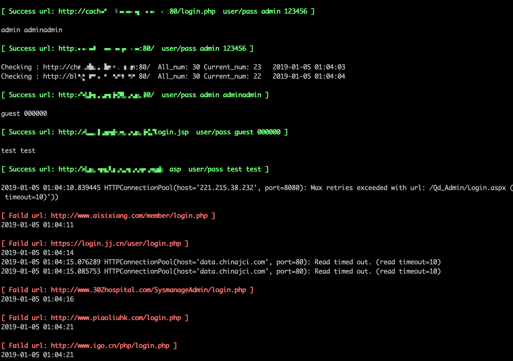
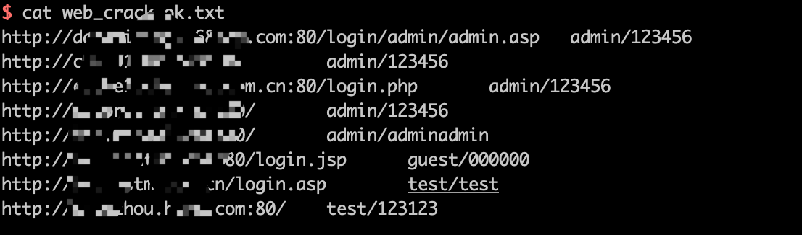
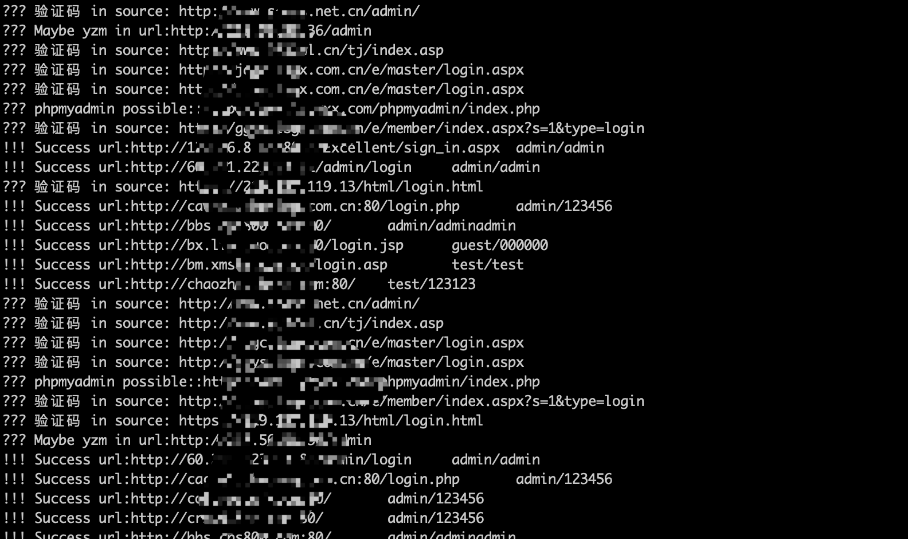

# web_pwd_common_crack
通用web弱口令破解脚本，旨在批量检测那些没有验证码的管理后台，可用于刷分~


# Change Log

- [2019-01-05] 对探测时出现的异常情况进行了处理，还是存在很多问题
- [2019-01-03] 使用了多线程
  
# Usage

使用比较简单：

安装requirements.txt依赖

```
pip install -r requirements.txt

```

运行脚本

```
python web_pwd_crack.py url.txt 50   --> url.txt为待扫描URL地址列表,50为线程数，默认为50
```

url.txt为待检测URL地址，可以自己写个脚本批量从搜索引擎获取，也可以自己用目录枚举工具去搜集。

# Method

- 原理：原理非常low，就是从页面中提取表单，对表单中的内容进行检索，发现存在用户名、密码、username、pwd、pass之类的字段则认为是登录页面，然后提取参数组成data数据，发送给crack函数进行破解。

- 稍微复杂的页面可能就没法正确识别，可能就会误报或者探测失败。

- 为防止探测多次之后出现封ip之类的情况，对成功的账户密码进行了重验证，以减少误报。

- python2环境，有些网页编码的处理存在问题 


# Screenshot

扫描过程如下



扫描成功的结果会保持在web_crack_ok.txt文件中



扫描中识别到验证码、phpmyadmin等所有的日志会保存在web_crack_log.txt文件中




# ToDo

- 验证码识别
- 减少误报率
- 优化编码处理
- 能不那么low


